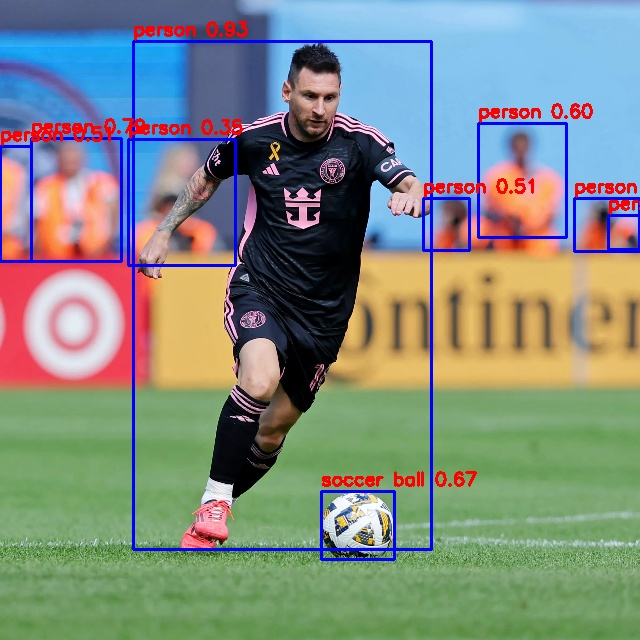

### RKNN Model Zoo Testing YOLO World (with CLIP Model)
```shell
pip install transformers
```
```shell
cd Projects/rknn_model_zoo/examples/yolo_world/model/
```

```shell
wget -O ./clip_text.onnx https://ftrg.zbox.filez.com/v2/delivery/data/95f00b0fc900458ba134f8b180b3f7a1/examples/clip/clip_text.onnx
wget -O ./yolo_world_v2s.onnx https://ftrg.zbox.filez.com/v2/delivery/data/95f00b0fc900458ba134f8b180b3f7a1/examples/yolo_world/yolo_world_v2s.onnx
```

- The CLIP text model only supports FP and not INT8
```shell
cd ../../python/clip_text/
python convert.py ../../model/clip_text.onnx rk3588 fp
```
- The Yolo World model (default : INT8)
```shell
cd ../../python/yolo_world/
python convert.py ../../model/yolo_world_v2s.onnx rk3588
```

- Run Models with Python
```shell
cd ..
python yolo_world.py --target rk3588
```

- It runs properly
```text
   class        score      xmin, ymin, xmax, ymax
--------------------------------------------------
   person       0.948     [ 477,  232,  559,  521]
   person       0.932     [ 110,  237,  226,  535]
   person       0.917     [ 211,  242,  283,  508]
   person       0.595     [  80,  326,  125,  514]
    bus         0.917     [  98,  135,  553,  436]
```

- result img custom text and custom img

